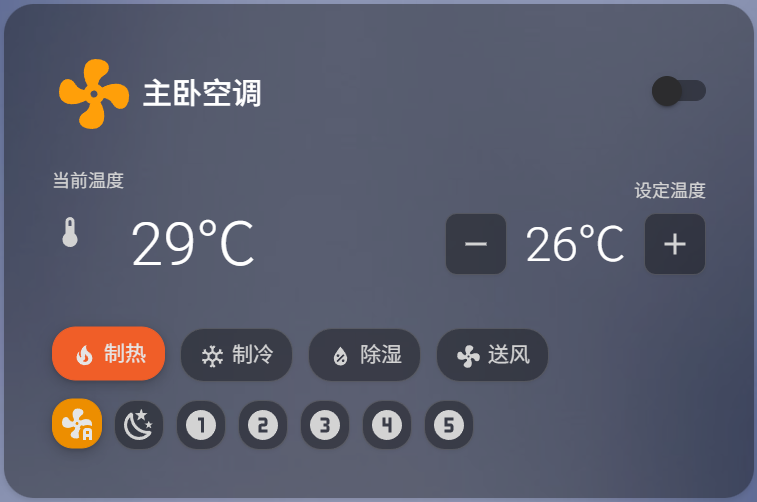
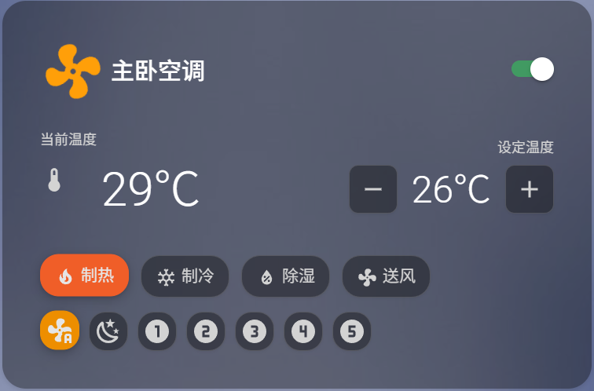
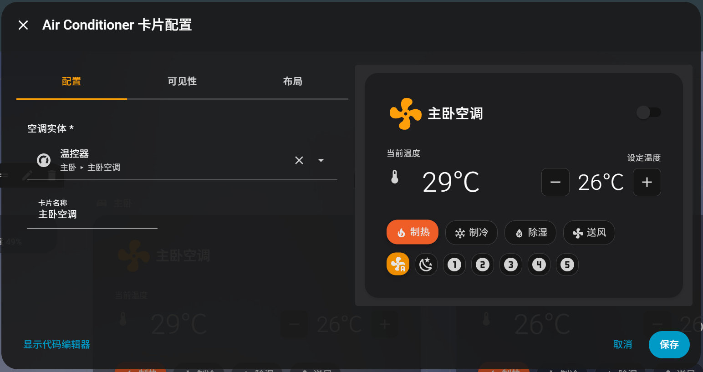
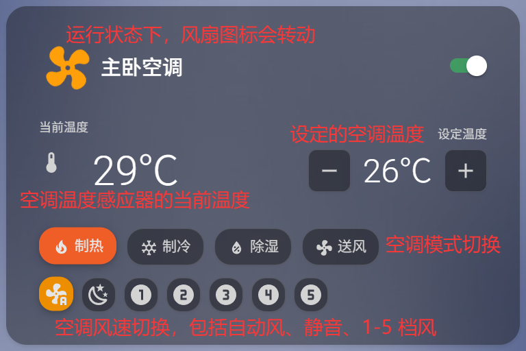

# 空调控制自定义卡片

一个美观、现代的 Home Assistant Lovelace 自定义卡片，用于控制空调设备。采用类似 Mushroom 的设计风格，支持亮色和暗色主题。



## 功能特性

- ✅ **模式切换**：制热、制冷、除湿、送风四种模式
- ✅ **温度控制**：直观的 +/- 按钮调节目标温度
- ✅ **风速控制**：自动、静音（睡眠模式）、1-5 档风速
- ✅ **开关控制**：一键开关空调
- ✅ **辅助功能**：静音开关、定时功能（如果实体支持）
- ✅ **实时显示**：当前温度、目标温度清晰显示
- ✅ **动态效果**：空调开启时风扇图标旋转动画
- ✅ **主题适配**：完美支持亮色和暗色主题
- ✅ **UI 配置**：支持可视化配置编辑器，无需手写 YAML



## 安装方法

### 方法一：通过 HACS 安装（推荐）

1. 在 HACS 中，进入 "Frontend" 分类
2. 点击右上角的三个点菜单
3. 选择 "Custom repositories"
4. 添加此仓库：
   - Repository: `LuckyStarry/lovelace-air-conditioner-card`
   - Category: `Frontend`
5. 点击 "Install" 安装
6. 在 Home Assistant 配置中添加资源

### 方法二：手动安装

1. 下载 `air-conditioner-card.js` 文件
2. 将文件复制到 Home Assistant 的 `www/air-conditioner-card/` 目录
3. 在 Home Assistant 配置中添加资源

## 配置资源

在 Home Assistant 的配置中添加资源：

**通过 UI 配置：**

1. 进入 "设置" > "仪表盘" > "资源"
2. 点击 "添加资源"
3. 选择 "JavaScript 模块"
4. 输入 URL: `/hacsfiles/lovelace-air-conditioner-card/air-conditioner-card.js`（HACS 安装）
   或 `/local/air-conditioner-card/air-conditioner-card.js`（手动安装）
5. 点击 "创建"

**通过 YAML 配置：**

在 `configuration.yaml` 中添加：

```yaml
lovelace:
  resources:
    - url: /hacsfiles/lovelace-air-conditioner-card/air-conditioner-card.js
      type: module
```

## 使用方法

### 通过 UI 配置（推荐）

1. 在 Lovelace 编辑模式下，点击 "添加卡片"
2. 搜索 "Air Conditioner Card" 或 "空调控制自定义卡片"
3. 在可视化编辑器中：
   - 选择空调实体（climate 实体）
   - 输入卡片名称（可选）
4. 点击 "保存"



### 通过 YAML 配置

#### 基本用法

```yaml
type: custom:air-conditioner-card
entity: climate.master_bedroom_ac
```

#### 带自定义名称

```yaml
type: custom:air-conditioner-card
entity: climate.master_bedroom_ac
name: 主卧空调
```

#### 在网格布局中使用

```yaml
type: grid
cards:
  - type: custom:air-conditioner-card
    entity: climate.bedroom_ac
    name: 卧室空调
    grid_options:
      columns: 6
      rows: auto
  - type: custom:air-conditioner-card
    entity: climate.study_ac
    name: 书房空调
    grid_options:
      columns: 6
      rows: auto
```

## 配置选项

| 参数     | 类型   | 必需 | 默认值 | 说明                     |
| -------- | ------ | ---- | ------ | ------------------------ |
| `entity` | string | ✅   | -      | 空调的 climate 实体 ID   |
| `name`   | string | ❌   | "空调" | 卡片显示的名称（可选）   |

## 支持的功能

### 空调模式

- **制热** 🔥：加热模式
- **制冷** ❄️：制冷模式
- **除湿** 💧：除湿模式
- **送风** 💨：仅送风模式

### 风速档位

- **自动风速**：自动调节风速
- **静音风速** 🌙：睡眠/静音模式（低风速）
- **1-5 档**：手动风速档位

### 温度控制

- 显示当前环境温度
- 显示目标温度
- +/- 按钮调节目标温度

## 依赖项

### 必需依赖（Home Assistant 内置，无需安装）

- ✅ `mwc-button` - Material Web Components（Home Assistant 已内置）
- ✅ `ha-card`, `ha-icon`, `ha-switch`, `ha-form` - Home Assistant 核心组件

### 可选依赖

无。此卡片**不需要任何额外依赖**！

## 界面说明



1. **标题栏**：显示卡片名称和开关按钮
2. **温度显示**：当前温度和目标温度
3. **模式选择**：制热、制冷、除湿、送风
4. **风速控制**：自动、静音、1-5 档
5. **辅助功能**：静音开关、定时功能（如果实体支持）

## 自定义样式

卡片使用 CSS 变量，可以通过 `card-mod` 自定义样式：

```yaml
type: custom:air-conditioner-card
entity: climate.ac
card_mod:
  style: |
    .air-conditioner-card {
      border-radius: 16px;
    }
```

## 故障排除

### 1. 卡片不显示

- 检查资源是否正确添加
- 检查浏览器控制台是否有错误
- 确认实体 ID 是否正确
- 尝试强制刷新页面（Ctrl+F5 或 Cmd+Shift+R）

### 2. 按钮无响应

- 检查实体是否支持对应的服务（`set_preset_mode`, `set_fan_mode`, `set_temperature`）
- 检查浏览器控制台是否有错误
- 确认实体状态正常

### 3. UI 配置编辑器不显示

- 确保已正确安装并添加资源
- 清除浏览器缓存
- 检查浏览器控制台是否有错误

### 4. 样式异常

- 清除浏览器缓存
- 检查是否有其他卡片样式冲突
- 确认 Home Assistant 版本是否支持（建议 2023.1.0+）

## 开发说明

### 文件结构

```
lovelace-air-conditioner-card/
├── air-conditioner-card.js    # 主卡片文件
├── README.md                   # 使用说明
├── hacs.json                   # HACS 配置
├── example-usage.yaml          # 使用示例
├── manifest.json               # 清单文件
└── LICENSE                     # 许可证
```

### 技术栈

- 原生 Web Components（不依赖 Lit）
- Material Web Components
- Home Assistant 核心组件

## 许可证

MIT License

Copyright (c) 2025 SUN BO

Permission is hereby granted, free of charge, to any person obtaining a copy
of this software and associated documentation files (the "Software"), to deal
in the Software without restriction, including without limitation the rights
to use, copy, modify, merge, publish, distribute, sublicense, and/or sell
copies of the Software, and to permit persons to whom the Software is
furnished to do so, subject to the following conditions:

The above copyright notice and this permission notice shall be included in all
copies or substantial portions of the Software.

THE SOFTWARE IS PROVIDED "AS IS", WITHOUT WARRANTY OF ANY KIND, EXPRESS OR
IMPLIED, INCLUDING BUT NOT LIMITED TO THE WARRANTIES OF MERCHANTABILITY,
FITNESS FOR A PARTICULAR PURPOSE AND NONINFRINGEMENT. IN NO EVENT SHALL THE
AUTHORS OR COPYRIGHT HOLDERS BE LIABLE FOR ANY CLAIM, DAMAGES OR OTHER
LIABILITY, WHETHER IN AN ACTION OF CONTRACT, TORT OR OTHERWISE, ARISING FROM,
OUT OF OR IN CONNECTION WITH THE SOFTWARE OR THE USE OR OTHER DEALINGS IN THE
SOFTWARE.
